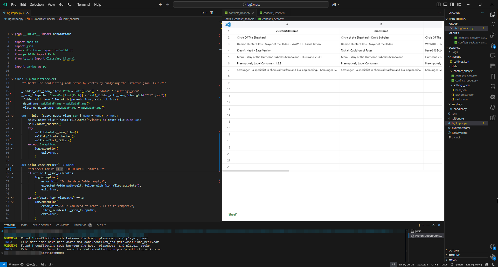

# Modded Multiplayer BG3 vortex conflict checker

This is very much still a work in progress project. If errors occur they will both be printed in console and loged to the `.logs` folder. Each error should contain a hint on what to do. Just follow the guidance provided.


## Installation instructions

1. Extract the zip file to a folder / clone as required
2. Open your terminal / powershell and cd to the folder
   - for example if you extracted bg3mpcc to this folder: `C:\BG3\bg3mpcc` run `cd C:\BG3\bg3mpcc`
3. Install [uv](https://docs.astral.sh/uv/getting-started/installation/) by:
   - macOS/linux -> Open your terminal and type -> `curl -LsSf https://astral.sh/uv/install.sh | sh`
   - Windows -> Open a **Powershell** (not cmd) -> `powershell -ExecutionPolicy ByPass -c "irm https://astral.sh/uv/install.ps1 | iex"`
4. Install python by running `uv --install python 3.11` if you don't have it
5. Initialise a virtual env: `uv venv`
6. Install dependancies -> `uv sync`


### If you followed the instructions you should see a folder structure like this:

```
📂 C:\bg3mmcc
┣━━ 📂 .venv
┣━━ 📂 .vscode
┣━━ 📂 data
┃   ┣━━ 📂 conflict_analysis
┃   ┃   ┗━━ __FILES_WITH_CONFLICTS_WILL_GO_HERE__
┃   ┗━━ 📂 settings_json
┃       ┗━━ __PLACE_YOUR_JSON_FILES_HERE__
┣━━ 📂 src
┃   ┗━━ 📂 logs
┃       ┗━━ handler.py (9.5 kB)
┣━━ LICENSE (35.8 kB)
┣━━ bg3mpcc.py (9.3 kB)
┣━━ pyproject.toml (3.0 kB)
┣━━ README.md (1.5 kB)
┗━━ uv.lock (39.6 kB)
```

## Usage

1. Each player should upload their startup.json file from `%userprofile%\AppData\Roaming\Vortex\temp\state_backups_full\`. Just throw it in a discord chat or something
2. Place all of them into the `/data/settings_json` folder
   - I would recommend renaming each file to a recognisable name so that you know which file belongs to each player. For eg `plsnomoar.json`, `bear.json`, `secks.json` etc. - Only use strings for the name, no spaces or special characters.
3. Run the script with the expected arguments: `uv run bg3mmcc.py --hosts-file="plsnomoar.json"`

Each file that conflicts with the host will have a list of conflicting mods saved in `data/conflict_analysis`



## Possible future features
- GUI
- Additional validation checks
- Possibility of networking checker for further automation


## License

This project is licensed under the [GNU General Public License v3.0](./LICENSE).
